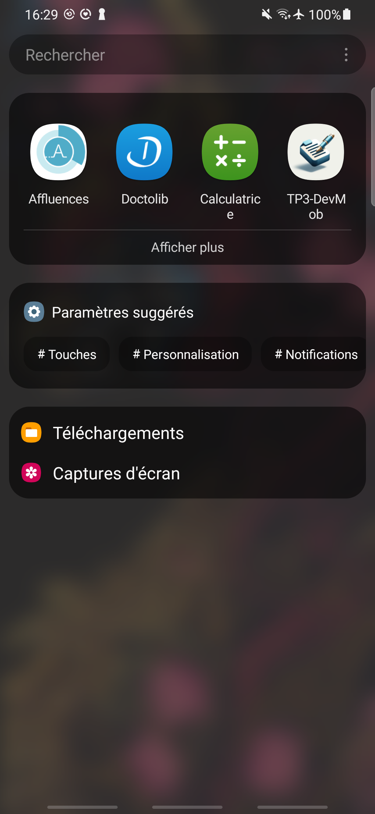
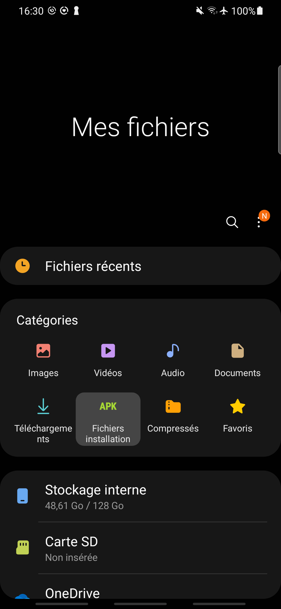
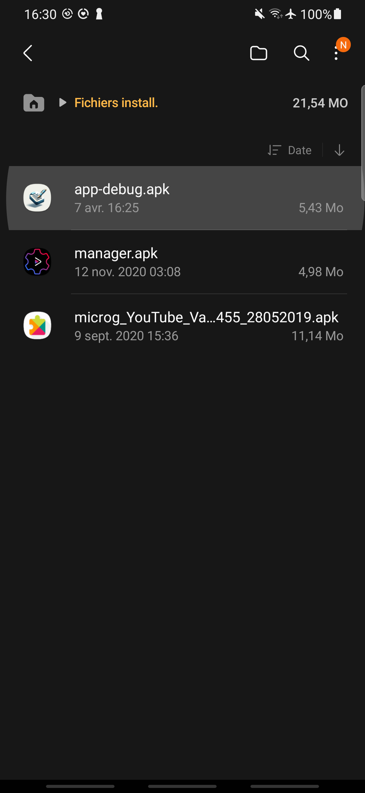
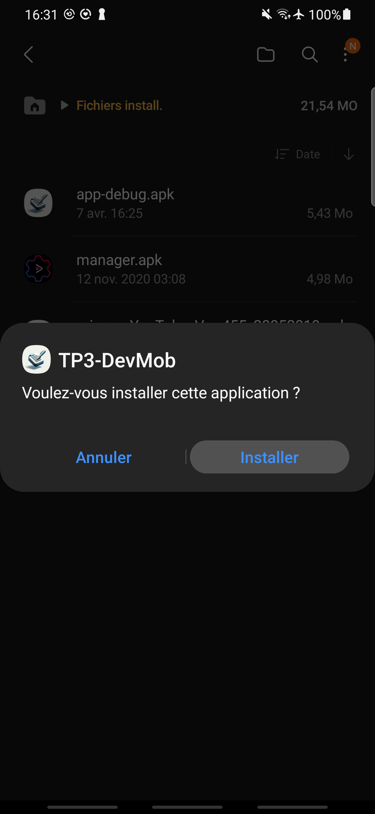
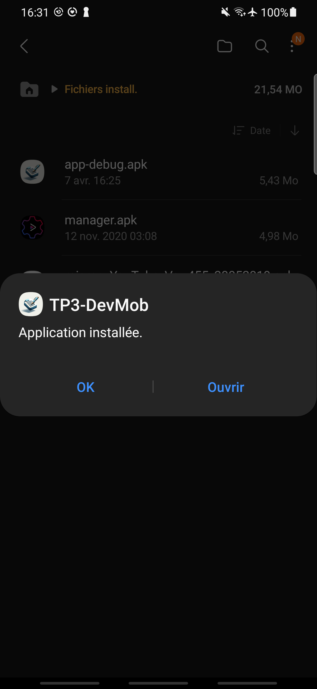
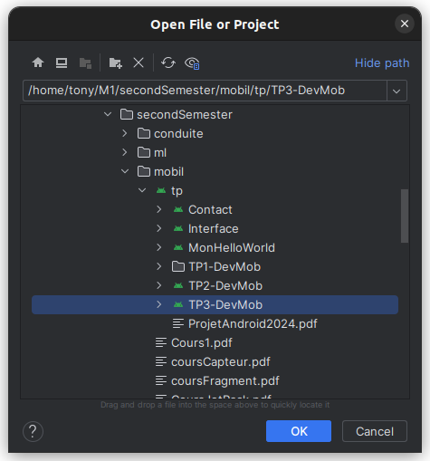
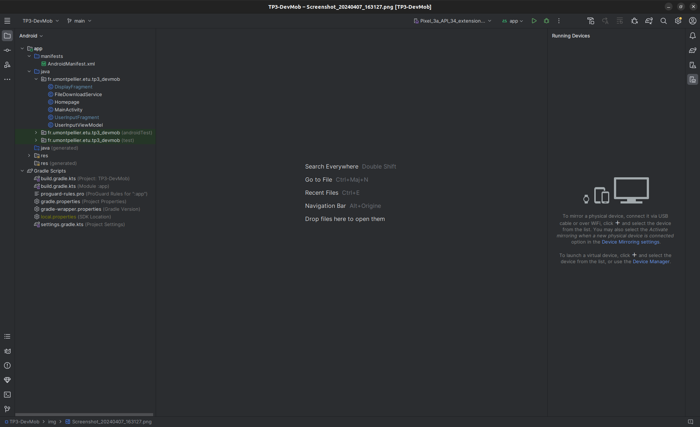
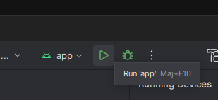

# TP3-DevMob

pdflatex -output-directory rapport/ rapport/rapport.tex 

# Installation

## Fichier .APK

Récupérer le fichier "app-debug.apk" dans TP3-DevMob → app → build → outputs → apk → debug.

Transférez le sur le smartphone et installez.

## Android Studio

Ouvrez le projet depuis Android Studio.

Puis appuyer sur "Run"

